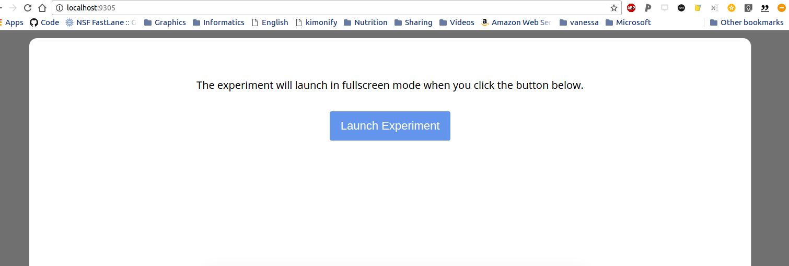

# Nginx Expfactory

This is an example of using a Singularity container to contain all dependencies for the [Experiment Factory](http://expfactory.github.io) software, meaning installation of python and the `expfactory` package, and then giving the command to generate the experiment battery to the container as an executable. The goal of this example is to show how easily you can wrap an entire analysis, environment, or whatever other dependencies you might have, and then serve something easily to a user.  If you haven't installed singularity, do that with [these instructions](http://singularity.lbl.gov/install-linux). Then Download the repo if you haven't already:

      git clone https://www.github.com/vsoch/singularity-web
      cd singularity-web

Let's now generate our expfactory.img from the build file (called Singularity) and run it!

      cd nginx-expfactory
      sudo singularity create --size 4000 expfactory.img
      sudo singularity bootstrap expfactory.img Singularity

You will see the image bootstrapping, including downloading of Docker layers, installation of nginx. What happens when we run it like an executable?

    
	optional arguments:
	  -h, --help            show this help message and exit
	  --folder FOLDER       full path to single experiment folder (for single
		                experiment run with --run) or folder with many
		                experiments (for battery run with --run)
	  --subid SUBID         subject id to embed in experiments data in the case of
		                a battery run with --run
	  --experiments EXPERIMENTS
		                comma separated list of experiments for a local
		                battery
	  --port PORT           port to preview experiment
	  --battery BATTERY_FOLDER
		                full path to local battery folder to use as template
	  --time TIME           maximum number of minutes for battery to endure, to
		                select experiments
	  --preview             preview an experiment locally (development function)
	  --run                 run a single experiment/survey or battery locally
	  --survey SURVEY       survey to run for a local assessment
	  --game GAME           game to run for a local assessment
	  --validate            validate an experiment folder
	  --psiturk             to be used with the --generate command, to generate a
		                psiturk battery instead of local folder deployment
	  --generate            generate (and don't run) a battery with --experiments
		                to a --folder
	  --output OUTPUT       output folder for --generate command, if a temporary
		                directory is not desired. Must not exist.
	  --test                test an experiment folder with the experiment robot

We see the command line usage for the executable! If you look at the `%runscript`, we've enforced that the user is using the container to run one or more experiments, represented by the `$@` which takes the input arguments we give the executable and gives them to our script.

	%runscript

	     cd /data
	     exec /usr/local/bin/expfactory --run --experiments "$@"

In the case above, we ran this:

	     /usr/local/bin/expfactory --run --experiments

which was not correct usage, so it spat out the correct usage for us. What happens if we give an experiment name?

        ./expfactory stroop
	No battery folder specified. Will pull latest battery from expfactory-battery repo
	No experiments, games, or surveys folder specified. Will pull latest from expfactory-experiments repo
	Generating custom battery selecting from experiments for maximum of 99999 minutes, please wait...
	Found 57 valid experiments
	Found 9 valid games
	Preview experiment at localhost:9684

In this case we are really running the command:

	/usr/local/bin/expfactory --run --experiments stroop

and if we open our browser to port 9684 (randomly selected) we see our stroop task! Awesome.

Notice how you can use the `%runscript` section to give the user more or less control over your executable. For example, if my runscript looked like this:

	%runscript

	     cd /data
	     exec /usr/local/bin/expfactory "$@"

The user could have full functionality to run a command other than `--run`, or specify `--surveys` instead of experiments. I would need to be clear about this in whatever documentation I provide.
